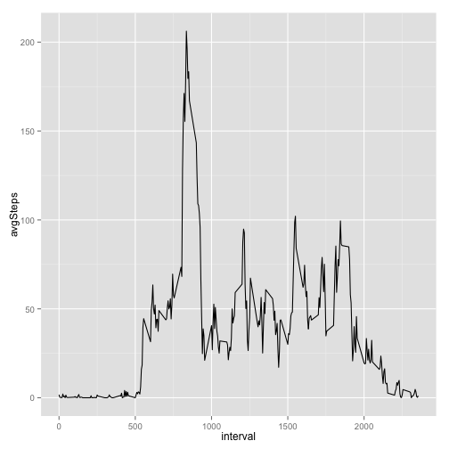
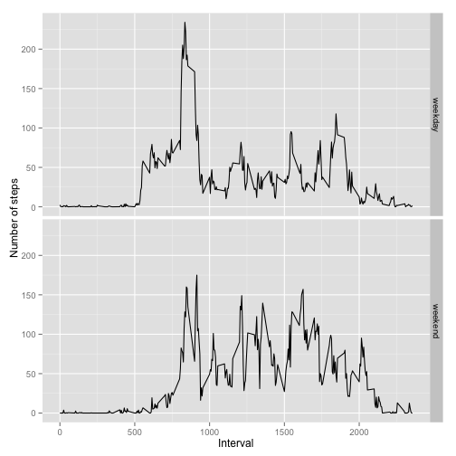

# Reproducible Research: Peer Assessment 1

## Loading and preprocessing the data
### 1. Load the data

```r
actData <- read.csv("activity.csv")
```
### 2. Process/transform the data (if necessary) into a format suitable for your analysis

```r
actData$date <- as.Date(actData$date)
head(actData, 5)
```

```
##   steps       date interval
## 1    NA 2012-10-01        0
## 2    NA 2012-10-01        5
## 3    NA 2012-10-01       10
## 4    NA 2012-10-01       15
## 5    NA 2012-10-01       20
```

## What is mean total number of steps taken per day?
### 1. Make a histogram of the total number of steps taken each day

```r
require(plyr, quietly=TRUE)
realData <- !is.na(actData$steps)
sumData <- ddply(actData[realData,],~date,summarise,sumSteps=sum(steps))
hist(sumData$sumSteps)
```

 
### 2. Calculate and report the mean and median total number of steps taken per day

```r
mean(sumData$sumSteps)
```

```
## [1] 10766
```

```r
median(sumData$sumSteps)
```

```
## [1] 10765
```

## What is the average daily activity pattern?
### 1. Make a time series plot (i.e. type = "l") of the 5-minute interval (x-axis) and the average number of steps taken, averaged across all days (y-axis)

```r
require(ggplot2, quietly=TRUE)
intervalAvgData <- ddply(actData[realData,],~interval,summarize,avgSteps=mean(steps))
ggplot(data=intervalAvgData, aes(interval, avgSteps)) + geom_line()
```

 
### 2. Which 5-minute interval, on average across all the days in the dataset, contains the maximum number of steps?

```r
intervalAvgData[intervalAvgData$avgSteps == max(intervalAvgData$avgSteps),]$interval
```

```
## [1] 835
```

## Imputing missing values
### 1. Calculate and report the total number of missing values in the dataset (i.e. the total number of rows with NAs)

```r
sum(!realData)
```

```
## [1] 2304
```
### 2. Devise a strategy for filling in all of the missing values in the dataset. The strategy does not need to be sophisticated. For example, you could use the mean/median for that day, or the mean for that 5-minute interval, etc.
I will use the mean for the 5-minute interval for a missing Value. 
### 3. Create a new dataset that is equal to the original dataset but with the missing data filled in.

```r
mergedData <- merge(actData, intervalAvgData,by.x="interval",by.y="interval",all.x)
head(mergedData, 5)
```

```
##   interval steps       date avgSteps
## 1        0    NA 2012-10-01    1.717
## 2        0     0 2012-11-23    1.717
## 3        0     0 2012-10-28    1.717
## 4        0     0 2012-11-06    1.717
## 5        0     0 2012-11-24    1.717
```

```r
imputedData <- transform(mergedData, steps = ifelse(is.na(steps), avgSteps, steps))
head(imputedData, 5)
```

```
##   interval steps       date avgSteps
## 1        0 1.717 2012-10-01    1.717
## 2        0 0.000 2012-11-23    1.717
## 3        0 0.000 2012-10-28    1.717
## 4        0 0.000 2012-11-06    1.717
## 5        0 0.000 2012-11-24    1.717
```

### 4. Make a histogram of the total number of steps taken each day and Calculate and report the mean and median total number of steps taken per day. Do these values differ from the estimates from the first part of the assignment? What is the impact of imputing missing data on the estimates of the total daily number of steps?

```r
imputedSumData <- ddply(imputedData,~date,summarise,sumSteps=sum(steps))
hist(imputedSumData$sumSteps)
```

 

```r
mean(imputedSumData$sumSteps)
```

```
## [1] 10766
```

```r
median(imputedSumData$sumSteps)
```

```
## [1] 10766
```

## Are there differences in activity patterns between weekdays and weekends?
### 1. Create a new factor variable in the dataset with two levels – “weekday” and “weekend” indicating whether a given date is a weekday or weekend day.

```r
actData$weekday <- ifelse(weekdays(actData$date) %in% c("Saturday","Sunday"), "weekend", "weekday")
head(actData, 5)
```

```
##   steps       date interval weekday
## 1    NA 2012-10-01        0 weekday
## 2    NA 2012-10-01        5 weekday
## 3    NA 2012-10-01       10 weekday
## 4    NA 2012-10-01       15 weekday
## 5    NA 2012-10-01       20 weekday
```
### 2. Make a panel plot containing a time series plot (i.e. type = "l") of the 5-minute interval (x-axis) and the average number of steps taken, averaged across all weekday days or weekend days (y-axis). 

```r
weeklyIntervalAvgData <- ddply(actData[realData,],c("weekday","interval"),summarize,avgSteps=mean(steps))
qplot(interval, avgSteps, data=weeklyIntervalAvgData, facets=weekday~., geom="path", ylab="Number of steps", xlab="Interval")
```

 
